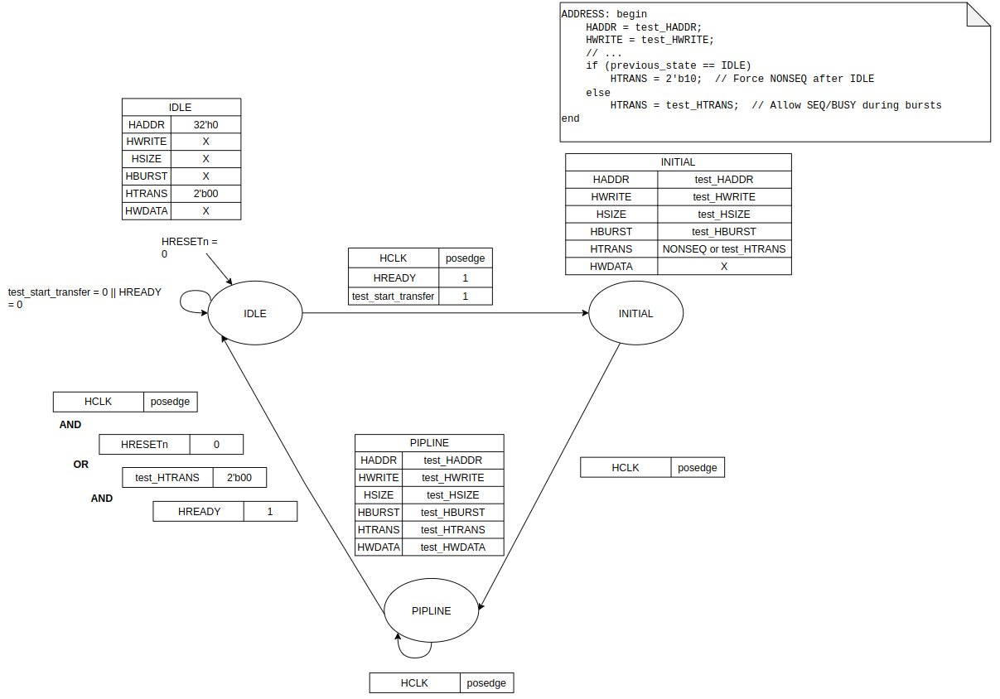
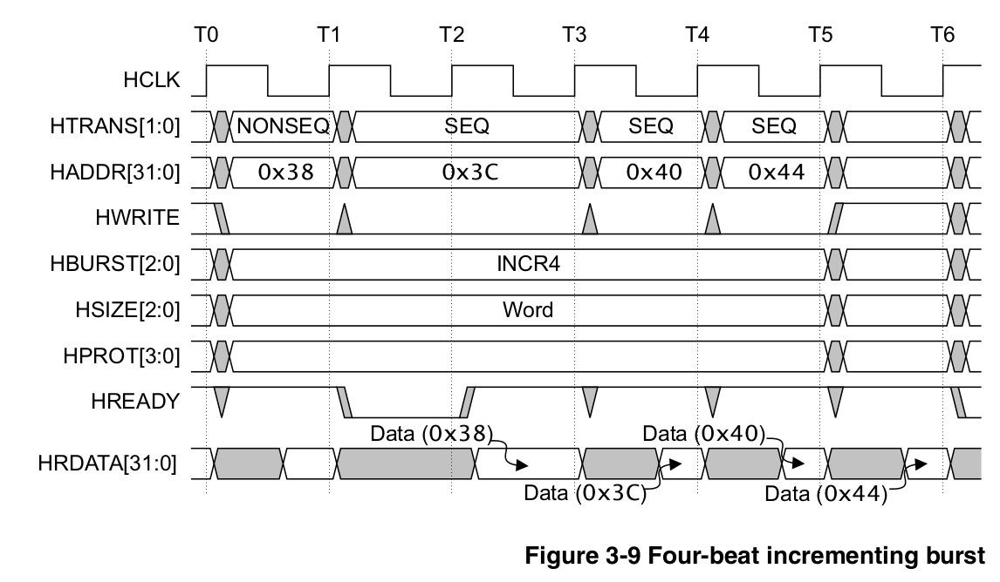
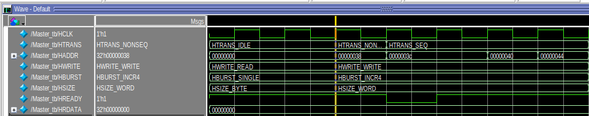
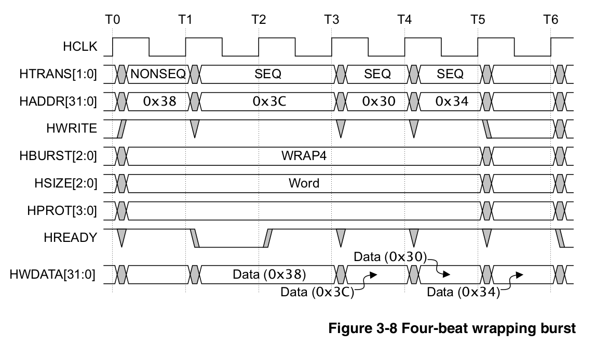
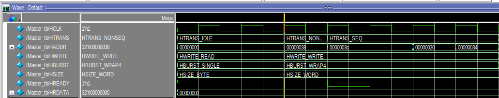

# AHB-Lite Master BFM

**Standards‑Compliant Verification Model** implementing AMBA® 3 AHB-Lite Protocol v1.0 Specification

## Key Features

- **Typed Ports**: Uses `ahb_pkg` enums (`htrans_t`, `hburst_t`, `hsizet`, etc.) for compile‑time protocol validation.
- **SVA Assertions**: Runtime checks for address alignment, INCR/WRAP4 increment, wrap boundaries, signal stability during wait states.
- **State Machine**: IDLE → INITIAL → PIPELINE with proper HTRANS sequencing (NONSEQ → SEQ → IDLE).

## Finite State Machine

**3-state FSM** drives AHB-Lite protocol sequencing per AMBA v1.0:



**State Behavior**:
- **IDLE**: All signals default (HTRANS=IDLE). Waits for `test_start_transfer`.  
- **INITIAL**: First beat (HTRANS=NONSEQ). Latches testbench inputs.  
- **PIPELINE**: Subsequent beats (HTRANS=SEQ). Continues until `test_HTRANS==IDLE && HREADY`.

**Key Timing**: `previous_state` tracked for INITIAL→NONSEQ detection. `prev_HREADY` enables wait-state stability assertions. 

**SVA validates**: Proper HTRANS progression, signal hold during !HREADY, address patterns per burst type.


## Run Instructions (QuestaSim)

```bash
vlog -sv ahb_pkg.sv Master.sv Master_tb.sv
vsim -c -do "run -all; quit" work.Master_tb
```

**Tests**: WRAP4+wait states, INCR4 bursts, single transfers. Assertions fail violations with diagnostics.

## Verification Results

**INCR4 Burst** (Word, 4 beats):
| Spec (AMBA v1.0) | Simulation |
|------------------|------------|
|  |  |

**WRAP4 Burst** (Word, 0x38→0x3C→0x30→0x34):
| Spec (AMBA v1.0) | Simulation |
|------------------|------------|
|  |  |

**✓ 100% Match**—Addresses, HTRANS, HBURST sequences identical to official timing diagrams. Zero assertion failures.